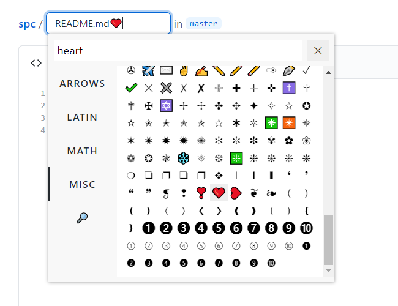

# ⓈⓅⒸ

I use special characters here and there frequently, so there is this.

## Installation

* [Chrome/Edge](https://chrome.google.com/webstore/detail/ebgmcealbemklkofilkmnnfnjebedmkd)
* [Firefox](https://addons.mozilla.org/en-US/firefox/addon/spc/)

## Usage

* Right click on the editing area and choose **Special Characters**
* Or, press `Alt + Period` (keys can be [configured](https://www.google.com/search?q=change+shortcut+keys+for+browser+extensions))

## Issues, contributing, etc.

Please feel free to report issues or contribute, and star this repo if it is useful to you. Any support is welcome.
